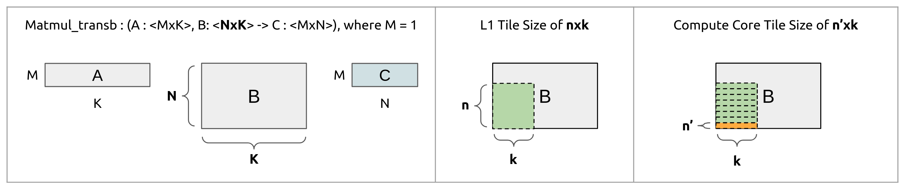

# Specify Tile Sizes for a Particular Linear Layer of NsNet2

TODO: Better Diagram



Each PyTorch Linear Layer inside NsNet2 eventually compiles to an IREE dispatch containing two linalg operations: a `linalg.matmul_tranpose_b` and a `linalg.generic` representing an element wise addition. In the case of these dispatches, the root operation is always the  `linalg.matmul_tranpose_b` operation.

**This guide explains how to *automatically*** 

- **COMPILE NsNet2 with a one of these five IREE dispatches customized with your requested tile sizes for tiling its root operation**
- **RUN this uniquely tiled NsNet2 on a verilator simulation of the Snitch Cluster**
- **EXPORT cycle count for each dispatch and the total cycle count to a CSV**
- **REPEAT these steps for many tiling configurations en masse**

## I. Run NsNet2 with a Dispatch M-N-K using an m-n-k tiling scheme

Navigate to the `Quidditch/comparing-tile-sizes directory` and do

```
. run_experiment.sh <searchSpace.csv> <genJsons?> <compile?> <run?> <export?> <caseNo> <dispatchName>
```

where

- `<searchSpace.csv>` is the name of the csv file assumed to be located inside directory `Quidditch/comparing-tiles-sizes/`. 

  ```
  JSON Name,Row Dim,Reduction Dim,Space Needed in L1,Weight Matrix Tile Size,Space Remaining,Case,Regular Loads,Total Streaming Loads,Other Streaming Loads,Start Reuse Streaming Loads,Reused Streaming Loads,Outer Loop Iters,HW Loop Body,HW Loop Iters,Microkernel Count,Microkernel Row Dim,Microkernel Reduction Dim
  0-24-8,24,8,3136,192,82464,1,45000,720000,360000,120000,240000,1,3,8,15000,3,8
  0-24-10,24,10,3920,240,81680,1,36000,720000,360000,120000,240000,1,3,10,12000,3,10
  0-24-12,24,12,4704,288,80896,1,30000,720000,360000,120000,240000,1,3,12,10000,3,12
  ```

  ^^ example input csv file ^^

  Each row of the spreadsheet represents a different tiling scheme for the same NsNet2 layer specified by  `<dispatchName>`. The rest of the layers inside NsNet2 will  use a the default scheme defined in `generateTileSizeJSONFiles.py`. See section IV for more details.

  If you only want to run NsNet2 once, just provide a CSV with a single row like in `ex_mini.csv`. 

- `<genJsons?>` is a flag to select whether to generate a JSON file for each tiling schemes specified in `searchSpace.csv`

  - `genJsons` enables this step
  - `no` skips this step

- `<compile?>` is a flag to select whether to compile the fakeNN for each tiling scheme specified

  - `compile` enables this step
  - `no` skips this step
  - `status` checks for compilation errors

- `<run?>` is a flag to select whether to run the fakeNN executable for each tiling scheme specified

  - `run` enables this step
  - `no` skips this step

- `<export?>` is a flag to select whether to export the results of each fakeNN to a csv file

  - `export` enables this step
  - `no` skips this step
  - `correctness` checks the output of each fakeNN run with the its corresponding golden output file.
  
- `caseNo` is a legacy option that should always be passed a value of `1`.

- `dispatchName` refers to the exact name of the IREE dispatch you would like to tile. There are only 5 dispatches in NsNet2 we can tile.

  | Possible dispatchName Values                                 |
  | ------------------------------------------------------------ |
  | `"main\$async_dispatch_9_matmul_transpose_b_1x161x600_f64"`  |
  | `"main\$async_dispatch_8_matmul_transpose_b_1x600x600_f64"`  |
  | `"main\$async_dispatch_0_matmul_transpose_b_1x400x161_f64"`  |
  | `"main\$async_dispatch_1_matmul_transpose_b_1x1200x400_f64"` |
  | `"main\$async_dispatch_7_matmul_transpose_b_1x600x400_f64"`  |

## II. Example Runs

It's recommended to perform one of the four steps, check the results, and then proceed to the next step.

1. generate jsons

   ```
   . run_experiment.sh "ex_1x600x600wm-n-k_case1_searchSpace.csv" "1x600x600wm-n-k" genJsons no no no 1 "main\$async_dispatch_8_matmul_transpose_b_1x600x600_f64"
   ```

2. compile

   ```
   . run_experiment.sh "ex_1x600x600wm-n-k_case1_searchSpace.csv" "1x600x600wm-n-k" no compile no no 1 "main\$async_dispatch_8_matmul_transpose_b_1x600x600_f64"
   ```

3. status (check for compilation errors)

   ```
   . run_experiment.sh "ex_1x600x600wm-n-k_case1_searchSpace.csv" "1x600x600wm-n-k" no status no no 1 "main\$async_dispatch_8_matmul_transpose_b_1x600x600_f64"
   ```

4. run

   ```
   . run_experiment.sh "ex_1x600x600wm-n-k_case1_searchSpace.csv" "1x600x600wm-n-k" no no run no 1 "main\$async_dispatch_8_matmul_transpose_b_1x600x600_f64"
   ```

5. export results

   ```
   . run_experiment.sh "ex_1x600x600wm-n-k_case1_searchSpace.csv" "1x600x600wm-n-k" no no no export 1 "main\$async_dispatch_8_matmul_transpose_b_1x600x600_f64"
   ```

## IV. Excerpt: Default Tiling Schemes for each Dispatch

Excerpt from `generateTileSizeJSONFiles.py`:

```
    # dispatch 1
    node = {}
    node["tile-sizes"] = [[0], [40], [100]]
    node["loop-order"] = [[2,0], [0,0], [1,0]]
    node["dual-buffer"] = True
    data["main$async_dispatch_1_matmul_transpose_b_1x1200x400_f64"]=node
    # dispatch 0
    node = {}
    node["tile-sizes"] = [[0], [40], [0]]
    node["loop-order"] = [[2,0], [0,0], [1,0]]
    node["dual-buffer"] = False
    data["main$async_dispatch_0_matmul_transpose_b_1x400x161_f64"]=node
    # dispatch 7
    node = {}
    node["tile-sizes"] = [[0], [40], [100]]
    node["loop-order"] = [[2,0], [0,0], [1,0]]
    node["dual-buffer"] = True
    data["main$async_dispatch_7_matmul_transpose_b_1x600x400_f64"]=node
    # dispatch 8
    node = {}
    node["tile-sizes"] = [[0], [40], [100]]
    node["loop-order"] = [[2,0], [0,0], [1,0]]
    node["dual-buffer"] = True
    data["main$async_dispatch_8_matmul_transpose_b_1x600x600_f64"]=node
    # dispatch 9
    node = {}
    node["tile-sizes"] = [[0], [56], [100]]
    node["loop-order"] = [[2,0], [0,0], [1,0]]
    node["dual-buffer"] = True
    data["main$async_dispatch_9_matmul_transpose_b_1x161x600_f64"]=node
```

