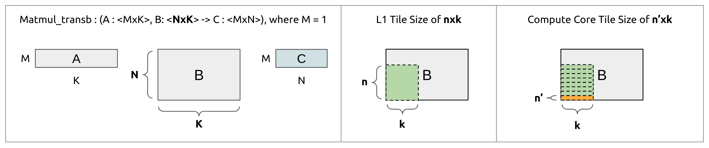

# Specify input sizes and tile sizes, and run on the Snitch Cluster!


## Run a Matrix-Vector Transpose given INPUT SIZE and TILE SIZE

Navigate to the `Quidditch/fakeNN directory` and do

```
. run_linear_layer.sh <searchSpace.csv> <genJsons?> <compile?> <run?> <export?> 
```

where

- `<searchSpace.csv>` is the name of the csv file assumed to be located inside directory `Quidditch/fakeNN//home/hoppip/Quidditch/fakeNN/linear-layer-search-space/` and specifies M, N, K, m, n, and k:

  ```
  JSON Name,M,N,K,m,n,k
  2x120x40w0-0-30,2,120,40,0,0,30
  2x120x40w0-0-100,2,120,40,0,0,100
  2x120x20w0-0-20,2,120,20,0,0,20
  2x120x20w0-0-60,2,120,20,0,0,60
  2x120x40w0-0-60,2,120,40,0,0,60
  ```

  ^^ example input csv file ^^

- `<genJsons?>` is a flag to select whether to generate a JSON file for each tiling schemes specified in `searchSpace.csv`

  - `genJsons` enables this step
  - `no` skips this step

- `<compile?>` is a flag to select whether to compile the fakeNN for each tiling scheme specified

  - `compile` enables this step
  - `no` skips this step
  - `status` checks for compilation errors

- `<run?>` is a flag to select whether to run the fakeNN executable for each tiling scheme specified

  - `run` enables this step
  - `no` skips this step

- `<export?>` is a flag to select whether to export the results of each fakeNN to a csv file

  - `export` enables this step
  - `no` skips this step
  - `correctness` checks the output of each fakeNN run with the its corresponding golden output file.

### Example Runs

```
clear;. run_linear_layer.sh one-run.csv genJsons status no no
clear;. run_linear_layer.sh one-run.csv genJsons compile no no
clear;. run_linear_layer.sh one-run.csv genJsons status no no
clear;. run_linear_layer.sh one-run.csv genJsons status run no
clear;. run_linear_layer.sh one-run.csv genJsons status run correctness
clear;. run_linear_layer.sh one-run.csv genJsons status run export
```

## old notes below

## Run for a selected input size and a bunch of tile sizes

```
sh run_experiment.sh <M> <N> <K> <searchSpace.csv> <outputDir> <genJsons?> <compile?> <run?> <export?> <dispNo> <dispName>
```
where

- `<M>`, `<N>`, and `<K>` correspond to the dimensions in the above context picture; *except M is allowed to be more than 1*.

- `<searchSpace.csv>` is the name of the csv file assumed to be located inside directory `Quidditch/fakeNN/searchSpaces`
-  `<outputDir>` is the name *(not path!*) of desired output directory
-  `<genJsons?>` is a flag to select whether to generate a JSON file for each tiling schemes specified in `searchSpace.csv`
  - `genJsons` enables this step
  - `no` skips this step
- `<compile?>` is a flag to select whether to compile the fakeNN for each tiling scheme specified
  - `compile` enables this step
  - `no` skips this step
  - `status` checks for compilation errors; it assumes compilation output for each tiling scheme exists.
- `<run?>` is a flag to select whether to run the fakeNN executable for each tiling scheme specified
  - `run` enables this step
  - `no` skips this step
- `<export?>` is a flag to select whether to export the results of each fakeNN to a csv file
  - `export` enables this step
  - `no` skips this step
  - `correctness` checks the output of each fakeNN run with the `golden_output.txt` file.
- `<dispNo>` specifies the number of the dispatch inside fakeNN to tile
  *notice that case number gets specified as a field in the `searchSpaces.csv` file!*
- `<dispName>` specifies the full dispatch name with the `$ `properly escaped with a `\`

For example,
```
sh run_experiment.sh 1 1200 400 "case1_searchSpace.csv" case_1 genJsons compile run export 1 "main\$async_dispatch_1_matmul_transpose_b_1x1200x400_f64"
```

- converts the tiling schemes specified in "case1_searchSpace.csv" to a set of JSON files

- compiles fakeNN with each of the specified tiling schemes

- runs the fakeNN executable for each of the specified tiling schemes

- exports the results to a CSV

## make a new script run-linear-layer.sh

only the subscript scrapeGrapeFruits.sh cares about the dispatchName! we only need the dispatchName to add it to a CSV file...

```
sh run_linear_layer.sh <searchSpace.csv> <genJsons?> <compile?> <run?> <export?>
```

ex: `. run_linear_layer.sh one-run.csv genJsons compile run export`


## run with verilator

```
../toolchain/bin/snitch_cluster.vlt /home/emily/Quidditch/build/runtime/samples/fakeNN/FakeNN
```

improved command (run form build directory):

```
../toolchain/bin/snitch_cluster.vlt runtime/samples/fakeNN/FakeNN
```

## run copy with verilator

```
toolchain/bin/snitch_cluster.vlt fakeNN/linear-layer-search-space/out/2x120x40w0-0-60/FakeNN
```

from inside build:

```
../toolchain/bin/snitch_cluster.vlt /home/hoppip/Quidditch/fakeNN/linear-layer-search-space/out/2x120x40w0-0-60/FakeNN
```

golden:

```
toolchain/bin/snitch_cluster.vlt fakeNN/linear-layer-search-space/golden-out/2x120x40w0-0-0/FakeNN
```

## checking correctness

```
diff /home/hoppip/Quidditch/fakeNN/linear-layer-search-space/out/2x120x40w0-0-60/run_output.txt /home/hoppip/Quidditch/fakeNN/linear-layer-search-space/golden-out/2x120x40w0-0-0/run_output.txt

```

```
clear;. run_linear_layer.sh one-run.csv genJsons status correctness export
```

