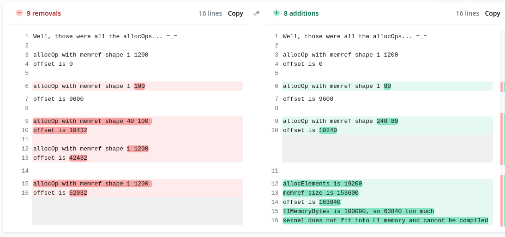
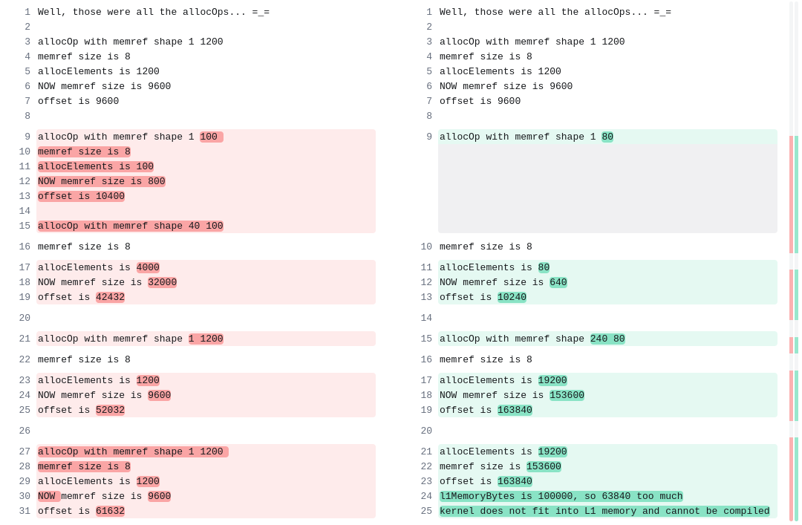

# Just Right vs Too Big Configs



- After the `240x80` memref, too-big just has two more `1x1200` memrefs like just-right.
- Is it padding/alignment that makes this tiling not fit? OR is the addition the cause?
- WHY are there THREE `1x1200` tensor allocations? Do I care as long as they both have them?



## LHS

```
1. allocOp with memref shape 1 1200 
2. allocOp with memref shape 1 100 
3. allocOp with memref shape 40 100  
4. allocOp with memref shape 1 1200  
5. allocOp with memref shape 1 1200  

1. 1200 * 8 = 9600 bytes; offset = 9600
2. 100 * 8 = 899 bytes; offset += 800 = 10400
3. 40 * 100 * 8 = 32000 bytes; offset += 32000 = 42400 BUT offset gets rounded UP tp 42432?!
4. 1200 * 8 = 9600 bytes; offset += 9600 = 52032
5. 1200 * 8 = 9600 bytes; offset += 9600 = 61632
61632 < 100000 so we fit in L1.
```

## RHS

```
1. allocOp with memref shape 1 1200
2. allocOp with memref shape 1 80  
3. allocOp with memref shape 240 80
4. allocOp with memref shape 1 1200
5. allocOp with memref shape 1 1200

1. 1200 * 8 = 9600 bytes; offset = 9600
2. 80 * 8 = 640 bytes; offset += 640 = 10240
3. 240 * 80 * 8 = 153600 bytes; offset += 153600 = 163840
163840 > 100000 so we DO NOT fit in L1!!!
```

ZigZag expects the following L1 allocations

```
1. tensor<1x400xf64>  // input matrix (entire thing in L1)
2. tensor<240x80xf64> // weight matrix tile
3. tensor<1x1200xf64>  // output matrix (entire thing in L1)

1. 400 * 8 = 3200 bytes; offset += 3200 = 3200
2. 240 * 80 * 8 = 153600 bytes; offset += 153600= 156800 <= would there be rounding????
3. 1200 * 8 = 9600 bytes; offset += 9600 = 166400
166400 > 100000 so we STILL DO NOT fit in L1!!!

Alternatively,
1200 + (240*80) + 400 = 24400 floats

Is my ZigZag model messed up?? I think so! I think it expects everything in terms of BITS.
L1 = 800000 in ZigZag land, NOT 100000.
```

And the actual L1 tiles sizes ZigZag expects to use are

```
1. tensor<1x80xf64>   // input matrix tile (subview of larger memref in L1)
2. tensor<240x80xf64> // weight matrix tile
3. tensor<1x240xf64>  // output matrix tile (subview of larger memref in L1)

Suppose we only allocated for the tile size used...
1. 80 * 8 = 640 bytes; offset += 640 = 640
2. 240 * 80 * 8 = 153600 bytes; offset += 153600 <= PROBLEM, THIS IS ALREADY BIGGER THAN L1
```


